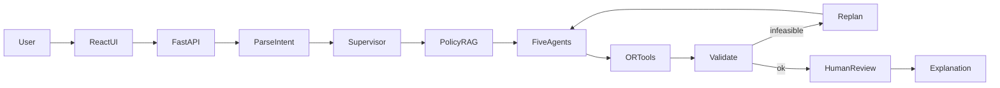

# OptiChain Final Report

OptiChain (also called SupplyChainAI) is a multi-agent supply-chain planning demo. A planner types a question in plain English. The system returns a buy-and-ship plan: who to order from, which lanes to use, how many units, what it costs, how long it takes, and why.

The language model does not invent the order quantities or the total cost. Specialist agents collect facts and constraints. Google OR-Tools calculates the plan. The screen then explains that plan and shows the policy documents that were retrieved.

All products, suppliers, orders, prices, weather, and policy documents in this project are **synthetic data for demonstration only**.

---

## 1. What problem it solves

A supply planner who needs units next month usually pieces the answer together from several places:

- order history and a forecast
- supplier price, capacity, lead time, and reliability
- warehouse stock and safety stock
- open routes, fuel, and disruptions
- written policy (sourcing rules, safety stock, disruption playbooks)

A general chatbot can sound confident and still make up quantities. OptiChain separates those jobs. Agents and the database supply the facts. A mathematical solver chooses the quantities. The explanation stays tied to those facts.

**Example request**

> I need 10,000 units of Product A next month. Find the lowest-cost supply plan with low risk.

**What comes back**

- a forecast beside the quantity the user asked for
- how much must still be bought after stock and safety stock
- supplier allocations and routes
- total cost, delivery time, and a risk score
- policy snippets used as evidence
- a written recommendation
- a human-review step so a planner can approve the plan or change the constraints

---

## 2. The solution in one sentence

Natural language in, evidence and constraints in the middle, an optimized and explainable supply plan out.

The design rule is simple: the model parses the request and the solver owns the numbers.

| Question | Who answers it |
|---|---|
| Which product and how many units were requested? | Intent parser (Gemini, or a built-in mock parser) |
| What do company policies say? | Hybrid search over the knowledge documents |
| What is the forecast, who can supply, which lanes exist, what stock is on hand, how risky is the network? | Five specialist agents reading PostgreSQL |
| How many units from which supplier on which route, at what cost? | OR-Tools |
| Is the plan consistent with capacity and demand? | Validator, with an automatic replan if it is not |
| Should this plan be accepted? | Human review in the UI |
| How do we explain it? | A recommendation assembled from the plan, the agents, and the retrieved documents |

---

## 3. Business value

- **One entry point.** The planner asks in English instead of jumping across spreadsheets for forecast, suppliers, routes, and stock.
- **Numbers that can be audited.** Each important figure is tied to a source: the database, the forecast method, agent reasoning, the solver, a policy document, or the user’s own quantity.
- **Cost and risk in the same decision.** The solver minimizes procurement, transport, holding, and a reliability penalty, while capacity, minimum order quantity, and optional low-risk limits stay in force.
- **Disruption practice.** What-if cases (a supplier fails, demand rises, fuel rises, a route closes, stock is short) rerun the same pipeline and compare the result with the baseline.
- **A person stays in the loop.** The plan is marked for review. The planner can approve it or send feedback such as “exclude supplier SUP-C and max lead time 25 days,” which becomes a new constrained plan.
- **Policies are used, not only stored.** Sourcing, safety-stock, disruption, and fuel documents are retrieved and shown next to the plan.

This is a local demo, not a live purchasing system. It does not connect to an ERP, and it does not authenticate users.

---

## 4. Components

| Layer | Technology | Role |
|---|---|---|
| User interface | React and Vite | Query box, KPIs, allocation and route tables, what-if, human review, evidence, agent trace |
| API | FastAPI | Decisions, what-if, review, catalog, health |
| Orchestration | LangGraph | Runs the steps in order and loops back when a replan is needed |
| Language model | Gemini 2.5 Flash, or mock | Reads the request into a structured intent. Mock mode needs no API key |
| Embeddings | Gemini, or a deterministic mock | Turns policy text into vectors for search |
| Knowledge search | PostgreSQL pgvector + full-text search | Hybrid retrieval of policy chunks |
| Database | PostgreSQL 16 | Products, suppliers, warehouses, inventory, routes, orders, risks, saved plans |
| Agents | Python services | Demand, Supplier, Route, Inventory, Risk |
| Optimizer | Google OR-Tools (MILP) | Chooses quantities, cost, and delivery time |
| Scenarios | What-if engine | Changes facts and reruns the plan |
| Human review | Review API + UI panel | Approve, or translate feedback into constraints |

---

## 5. Simple flow



In words:

1. The planner types a request in the React app.
2. FastAPI starts a LangGraph run and stores the result.
3. The intent step extracts the product, quantity, risk preference, and any scenario language.
4. The supervisor selects the specialist agents. A normal plan uses all five.
5. Policy search pulls relevant knowledge-base passages.
6. The five agents read the database and build the planning facts.
7. OR-Tools solves for quantities and cost.
8. Validation checks that the allocation covers the net requirement and respects supplier capacity.
9. If the plan is infeasible, a replan relaxes the lead-time and low-risk limits and the agents run again (up to two times).
10. A human-review checkpoint marks the plan as waiting for approval.
11. The explanation summarizes demand, net buy, cost, time, risk, suppliers, routes, and evidence.

The UI then shows the plan. The planner can approve it, send constraint feedback, or run a what-if case.

---

## 6. How each part works

### 6.1 Intent parser

The parser turns the sentence into a structure: product, quantity, planning horizon, maximum lead time, whether low risk was requested, and any constraints written in the sentence.

Without an API key, a mock parser uses simple patterns. It still extracts “10,000 units of Product A” and a low-risk request. If Gemini is configured and the call fails, the failure is recorded as a warning and the mock parser is used so the plan can still be produced. The default Gemini model is `gemini-2.5-flash`.

Phrases such as “supplier SUP-C fails,” “fuel +15%,” or “max lead time 20 days” become constraints before the agents run.

### 6.2 Supervisor

The supervisor decides which agents are needed. A full supply plan uses demand, supplier, route, inventory, and risk. A question that is only about inventory can skip supplier and route work.

### 6.3 Policy retrieval (RAG)

Markdown files in `data/knowledge/` are split into chunks, embedded, and stored in PostgreSQL. Search uses two methods and merges them:

- dense search compares the question with stored vectors
- keyword search uses PostgreSQL full-text ranking
- the two lists are fused with reciprocal rank fusion, then a word-overlap rerank

The knowledge set covers sourcing policy, safety stock, the disruption playbook, fuel surcharge, risk scoring, transport modes, and a Product A brief. The top passages are shown as evidence and cited in the recommendation. Policy quotes are labeled as coming from a document, not from the solver.

Mock embeddings are deterministic and based on the words in the text, so related passages rank near each other even without a paid embedding API. If older random vectors are still in the database, startup rebuilds them.

### 6.4 The five agents

Agents gather facts. They do not choose how many units to buy.

**Demand.** Looks up the product and the last 24 months of orders. When a year or more of history exists, the forecast blends a seasonal naive value with the recent three-month average. If the user named a quantity, that quantity is what the plan must meet. Otherwise the forecast is used. The forecast method is recorded so it is not confused with a model guess.

**Supplier.** Lists offers for that product: price, monthly capacity, lead time, minimum order, reliability, and risk tier. An offer is ineligible when the supplier is inactive, named in a failure scenario, or slower than the allowed lead time. High-risk suppliers can remain eligible and are penalized in the solver instead of being deleted silently.

**Route.** Builds lanes from eligible suppliers to warehouses. A closed or disrupted lane has its capacity set to zero. Effective transport cost is the lane rate times the fuel factor times any what-if fuel multiplier.

**Inventory.** Across the four distribution centers, available stock is on-hand minus reserved. Net buy equals demand minus available stock, plus any gap needed to keep safety stock. The point is to avoid buying stock the network already has, without stripping warehouses bare.

**Risk.** Builds a 0–100 score from supplier reliability, high risk tiers, open risk events, weather, disrupted routes, and the marine fuel index versus its baseline. The score is a fixed rubric over database facts. A scenario label can add a small, visible driver so the planner sees that a what-if case is active.

### 6.5 Optimizer

Decision variables are units on each supplier-and-route lane.

Typical constraints:

- meet the net requirement
- respect each supplier’s monthly capacity and minimum order quantity
- respect route capacity
- respect remaining warehouse space
- when low risk is requested: a reliability floor, a cap on volume from high-risk suppliers, and a cap on how much any one supplier can take

The objective minimizes procurement cost, effective transport cost, a short holding component, and a penalty for less reliable suppliers.

The result includes status (optimal or feasible), total cost split into procurement and transport, the longest fulfillment time, the allocation lines, and any unmet demand.

### 6.6 Validation and replan

Validation checks that filled units cover the net requirement and that no supplier is assigned more than its capacity. Missing evidence is noted and does not by itself fail the plan.

If the plan is not acceptable, and the replan limit is not used up, the graph relaxes the maximum lead time by 15 days and turns off the hard low-risk flag, then runs the specialists and the solver again.

### 6.7 Human review

Every completed plan starts as `pending_review`.

- **Approve** marks that run approved.
- **Apply feedback** reads the planner’s sentence, turns it into constraints, and runs a new plan linked to the original. Supported feedback includes excluding a supplier, closing a route, a maximum lead time, a minimum reliability, a cap on one supplier’s share, and demand, price, fuel, or inventory changes.

The new plan is compared with the parent on cost, delivery time, risk, and unmet demand.

### 6.8 Explanation

The recommendation is written from the plan itself: demand, forecast method, net buy, solver status, cost split, delivery time, risk score, supplier totals, the largest routes, and the titles of retrieved documents. It states that quantities came from OR-Tools using database prices, capacities, lead times, and route costs.

### 6.9 What-if

A what-if does not edit the story after the fact. It changes the facts and runs the same agents and solver again.

| Scenario | What changes |
|---|---|
| Demand increase | Demand is scaled up |
| Supplier failure | That supplier cannot be used |
| Price increase | Unit prices are scaled up |
| Fuel increase | Transport fuel cost is scaled up |
| Route disruption | That lane’s capacity goes to zero |
| Inventory shortage | On-hand stock is scaled down |
| Natural language | A sentence such as “supplier SUP-C fails and fuel +15%” is interpreted into the same kind of changes |

The screen shows baseline, scenario, and the delta.

---

## 7. Where each number comes from

| Kind of number | Source |
|---|---|
| Prices, capacity, inventory, routes, events | Database |
| Next-period forecast | Forecast method on order history |
| Eligibility and net requirement | Agent rules |
| Quantities, total cost, delivery time | Solver |
| Policy quotes | Retrieved documents |
| Requested quantity | The user’s sentence |

---

## 8. Sample world

The seeded network is an Indian demo chain.

- **10 products**, including Product A (`PROD-A`)
- **7 suppliers:** Tata Components (Pune), Reliance Parts (Ahmedabad), Mahindra Precision (Nashik), Delhi Metals (Delhi), Bharat Forge (Kolkata), Godrej Fabrication (Hyderabad), Jindal Manufacturing (Surat)
- **4 distribution centers:** Delhi, Bangalore, Chennai, Mumbai
- **16 routes** between those suppliers and warehouses, with mode, distance, hours, cost, capacity, and fuel factor
- **24 months** of seasonal orders
- Risk events, weather events, and fuel-index history
- The policy documents listed in section 6.3

---

## 9. What the screen shows

- a text box for the planning question
- status badges for review state and solver status
- forecast, total cost, delivery hours, risk score, and solver status
- supplier allocation and route tables
- inventory availability and net buy
- human review: approve, or type a constraint and replan
- what-if controls, including a natural-language scenario, and a comparison table
- the written recommendation
- retrieved evidence
- the agent trace, so the steps are visible

---

## 10. API

Base path: `/api/v1`. Interactive docs: `http://localhost:8000/docs`.

| Method | Path | Purpose |
|---|---|---|
| GET | `/health` | Service and database check |
| GET | `/catalog` | Products and suppliers for the UI |
| POST | `/decisions` | Run a plan from a natural-language query |
| GET | `/runs/{run_id}` | Fetch a saved plan |
| POST | `/decisions/{run_id}/review` | Approve, or replan from feedback |
| POST | `/what-if` | Rerun from a saved plan with a scenario |

---

## 11. How to run it locally

Docker Desktop is used for PostgreSQL with pgvector. The API and the UI run on the PC.

**Database**

```powershell
cd "D:\Agentic AI"
docker compose up db -d
```

**API** (http://localhost:8000/docs)

```powershell
cd "D:\Agentic AI\backend"
.\.venv\Scripts\activate
$env:PYTHONPATH="."
uvicorn app.main:app --reload --port 8000
```

**UI** (http://localhost:5173)

```powershell
cd "D:\Agentic AI\frontend"
npm run dev
```

Copy `.env.example` to `.env` before the first run. On this Windows setup the database is mapped to port **5433** so it does not collide with a local PostgreSQL on 5432.

To start the database, API, and UI together:

```powershell
docker compose up --build
```

Without an API key, intent parsing and embeddings stay in mock mode. Forecasts, prices, and quantities still come from the data and OR-Tools.

---

## 12. Limits

- The catalog, history, and policies are synthetic. Do not use the output for a real purchase order.
- There is no login, no multi-company data, and no live ERP connection.
- The explanation is assembled from the computed plan. It does not let the language model replace the solver’s quantities.
- Some very specific wording (a named warehouse, a preferred transport mode, or an hour-level deadline) is not a separate solver constraint unless it matches the supported constraint phrases, such as supplier exclusion, route disruption, lead time, reliability, share caps, and demand, price, fuel, or inventory changes.

---

## 13. Project map

```text
backend/app/agents/        Demand, Supplier, Route, Inventory, Risk
backend/app/graph/         LangGraph steps and shared state
backend/app/rag/           Ingest, embeddings, hybrid search
backend/app/optimization/  OR-Tools model
backend/app/whatif/        Scenario patches and comparisons
backend/app/hitl/          Feedback turned into constraints
backend/app/scenarios/     Scenario state shared by agents and the solver
backend/app/api/           FastAPI routes
frontend/src/pages/        Planner screen
frontend/src/components/   Review panel, KPIs, comparison, status
data/knowledge/            Policy documents for retrieval
```
